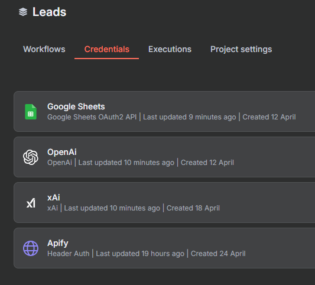

# Summary

# Pre-Requisites
## Accounts
For this project you will need the following accounts:
- n8n
- Apify
- OpenAi
- xAi
- Google

## API Keys
Once you have created the necessary accounts,
you will need their respective APIs. 
Below is a list of links for how to create an 
API Key for each of the necessary accounts:
- [Apify](https://blog.apify.com/scoped-api-tokens/#:~:text=with%20your%20account.-,How%20to%20create%20scoped%20API%20tokens,-Creating%20a%20scoped)
    - You don't need to limit the token permissions, but you can if you'd like.
- [OpenAi](https://www.codecademy.com/article/creating-an-openai-api-key)
- [xAi](https://docs.typingmind.com/manage-and-connect-ai-models/xai-(grok-ai)#8d9cb96c5b85421b9ae4d025c264aba5)

# Getting Started
1. Open your n8n workspace
2. Create a new project, if you haven't already
    - You can call it whatever you want. I labeled mine as "Leads"
    - You can use your Personal project, but creating a new project is better for organization
3. Create your Credentials for the following accounts.

